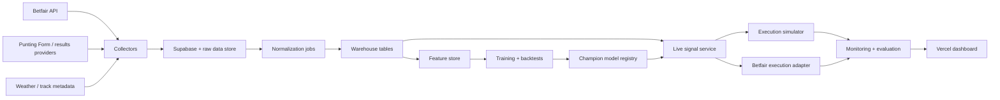

# Racing System Architecture

Last updated: 2026-03-28

## Recommended v1 scope

Start narrower than the full vision.

### Target market

- Australian thoroughbred racing only.
- NSW and VIC metro meetings first.
- Win markets only for live execution.
- Betfair Exchange as the only execution venue in v1.
- Tote prices and fixed odds used as reference inputs, not execution venues, until the win model is stable.

### Why this scope

- Best data density.
- Highest liquidity.
- Cleaner execution.
- Simplest model target.
- Fastest path to calibrated probabilities, CLV tracking, and paper-trade validation.

## System goals

- Estimate private probabilities for each runner.
- Blend private probabilities with market priors.
- Compute post-cost expected value.
- Simulate or place bets late with strict risk controls.
- Learn from settled results and market behavior without contaminating point-in-time features.

## System boundaries

### In scope for v1

- Historical warehouse.
- Market snapshot collector.
- Feature store.
- Private win model.
- Market calibration layer.
- Paper execution engine.
- Live micro-staking engine on Betfair only.
- Monitoring and audit trail.

### Out of scope for v1

- Full exotics engine.
- Corporate bookmaker automation.
- Purely subjective manual trip-note workflow.
- Fully automated cap increases.
- Self-modifying live models without offline validation.

## Recommended stack

This repo already has a Next.js app and Supabase client wiring, so the cleanest build is:

### Control plane

- Vercel-hosted Next.js app for dashboard, research notes, monitoring, approvals, and ops views.

### Data and modeling plane

- Python for ingestion, feature engineering, backtesting, and modeling.
- Lightweight APIs or scheduled jobs for serving model outputs into the app.

### Storage

- Supabase Postgres for operational tables, normalized racing data, model outputs, and execution logs.
- Object storage or Parquet files for raw snapshots and large historical backfills.
- DuckDB for ad hoc research and fast local backtests.

### Why this split

- Vercel route handlers are a good fit for authenticated provider adapters, cron-triggered collectors, and control-plane APIs.
- JavaScript is fine for the product surface and route handlers.
- Python is much stronger for numerical modeling, calibration, backtesting, and research workflows.
- Supabase Postgres gives us transactions, auditability, RLS, and simple joins for ops.
- Parquet plus DuckDB gives us cheap, reproducible historical analysis.

## High-level architecture



## Core services

### 1. Meeting and race collector

Responsibilities:

- Discover upcoming meetings and races.
- Create canonical race IDs.
- Map provider-specific race IDs to internal IDs.

Inputs:

- Punting Form meeting/form endpoints.
- Betfair event and market discovery.

Outputs:

- `meetings`
- `races`
- `provider_market_map`

### 2. Market snapshot collector

Responsibilities:

- Poll upcoming Betfair win markets at varying frequencies as jump time approaches.
- Store back and lay ladders, last traded price, traded volume, and total matched.
- Optionally collect tote and fixed-odds references.

Polling profile:

- T-180 to T-60 mins: every 5 mins.
- T-60 to T-15 mins: every 1 min.
- T-15 to T-2 mins: every 10-15 seconds.
- T-2 to jump: every 2-5 seconds if rate limits allow.

Outputs:

- `market_snapshots`
- `runner_market_snapshots`

### 3. Results and race-data collector

Responsibilities:

- Pull official results and runner metadata.
- Capture sectionals, margins, settle position, stewards comments, scratchings, gear changes, and track notes.

Outputs:

- `race_results`
- `runner_results`
- `runner_form_lines`
- `track_conditions`

### 4. Feature builder

Responsibilities:

- Transform raw and normalized data into point-in-time safe features.
- Freeze features at configurable decision timestamps such as T-10, T-5, T-2 minutes.

Feature families:

- Ability and speed.
- Pace and settle pattern.
- Fitness and form cycle.
- Class and competition.
- Track-distance suitability.
- Stable and jockey intent proxies.
- Market microstructure.
- Bias and regime features.

Outputs:

- `feature_snapshots`
- `feature_values`
- model-ready training matrices in Parquet.

### 5. Model trainer

Responsibilities:

- Train baseline and challenger models.
- Calibrate outputs.
- Evaluate predictive and trading metrics.
- Publish approved models to the registry.

Models in order:

1. Market-implied baseline.
2. Private multinomial logit.
3. Private gradient boosting or ranker.
4. Blend meta-model.

Outputs:

- `model_registry`
- `model_runs`
- `evaluation_runs`

### 6. Signal service

Responsibilities:

- Load the current champion model.
- Score upcoming races at the configured decision time.
- Blend with the latest market state.
- Compute fair odds, EV, robust EV, and recommended stake.

Outputs:

- `live_runner_prices`
- `bet_recommendations`

### 7. Execution and risk engine

Responsibilities:

- Enforce daily and race-level limits.
- Check stale data and slippage thresholds.
- Simulate orders in paper mode.
- Submit and reconcile Betfair orders in live mode.

Risk checks before each bet:

- Daily turnover cap not breached.
- Daily loss cap not breached.
- Max race exposure not breached.
- Max runner exposure not breached.
- Model freshness within SLA.
- Snapshot freshness within SLA.
- Liquidity and slippage within tolerance.

Outputs:

- `orders`
- `bets`
- `risk_events`

## Platform deployment

### Vercel responsibilities

- Host the web app.
- Host authenticated serverless route handlers.
- Run scheduled collectors via cron hits to internal API routes.
- Serve internal monitoring and manual approval tooling.

### Supabase responsibilities

- Store canonical racing tables.
- Store raw provider payloads for replay.
- Store feature snapshots, model outputs, recommendations, orders, and settlements.
- Enforce service-role access for ingestion and execution tables.

### External API responsibilities

- Betfair:
- market discovery.
- live prices.
- order placement and reconciliation.
- Punting Form:
- meetings.
- fields.
- form and ratings context.

### 8. Monitoring and feedback

Responsibilities:

- Track CLV, slippage, ROI, drawdown, and calibration.
- Compare champion vs challenger.
- Surface data breaks, market mapping errors, and stale collectors.

Outputs:

- `execution_metrics_daily`
- `model_metrics_daily`
- `alerts`

## Decision-time framework

Use fixed decision checkpoints per race.

Recommended checkpoints:

- Research training snapshots at T-30, T-10, T-5, and T-2.
- Paper-trading trigger at T-5.
- Live trigger initially at T-2 to T-1, where information is richest.

Why this matters:

- It prevents leaking post-decision information into features.
- It lets us compare the value of earlier versus later information.
- It makes slippage assumptions measurable.

## Model hierarchy

### Layer 0: market-only control

- Convert Betfair best-back or mid-market prices into implied probabilities.
- De-vig or normalize to a coherent field.
- This is the benchmark every private model must beat.

### Layer 1: private probability model

- A field-aware runner model producing race-level probabilities.
- Start simple and interpretable.

### Layer 2: calibration and blend

- Use market probabilities and selected microstructure features to recalibrate private estimates.
- This is where the Benter insight lives.

### Layer 3: execution policy

- Only turn probabilities into bets after cost, uncertainty, and portfolio constraints.
- This is where desk behavior differs from a prediction notebook.

## Champion-challenger process

- Only one live champion model at a time.
- Challengers score in shadow mode first.
- Promote challengers only if they outperform on rolling out-of-sample windows.

Promotion gate:

- Better log loss or Brier score.
- Better calibration.
- Better paper CLV.
- No worse drawdown profile.
- Stable across venue and condition slices.

## Risk framework

### Hard limits

- Daily max turnover.
- Daily max realized loss.
- Max open exposure.
- Max race exposure.
- Max runner exposure.
- Max model confidence allowed for staking.

### Soft limits

- Reduce stake when:
- liquidity is thin.
- private and market models diverge too much.
- track bias regime is unstable.
- late scratches cause map uncertainty.

### Kill switches

- Provider outage.
- Mapping mismatch between race and market.
- Clock drift or stale snapshots.
- Unreconciled live orders.
- Abnormal slippage.
- Drawdown breach.

## Recommended operating modes

### Mode 1: historical backtest only

- No live collectors required beyond archived data.
- Goal: validate point-in-time schema and basic modeling.

### Mode 2: live paper trading

- Run collectors live.
- Produce real-time recommendations.
- Simulate fills using available market depth.

### Mode 3: micro-live

- Betfair only.
- Small daily cap.
- Human-supervised review each day.

### Mode 4: scaled live

- Increase size only after a meaningful sample and stable CLV.
- Still require explicit manual approval for cap increases.

## Suggested repo structure

```text
docs/research/
src/app/(dashboard)/racing-desk/
src/app/api/racing-desk/
src/lib/racing-desk/
python/racing_lab/
python/racing_lab/collectors/
python/racing_lab/features/
python/racing_lab/models/
python/racing_lab/backtests/
python/racing_lab/execution/
python/racing_lab/tests/
data/raw/
data/processed/
```

## Immediate implementation order

1. Lock the canonical schema and provider mapping rules.
2. Build the market snapshot collector.
3. Build the results and metadata collectors.
4. Backfill a minimum historical sample for NSW/VIC metro win markets.
5. Implement the market-only control model.
6. Implement the first private multinomial logit model.
7. Build the calibration and blend layer.
8. Build paper execution and CLV tracking.
9. Run shadow mode before any live stake.

## Non-negotiables

- No point-in-time leakage.
- No automatic live model promotion.
- No automatic cap increases.
- No live betting if reconciliation or freshness checks fail.
- No evaluating the strategy on hit rate alone.
